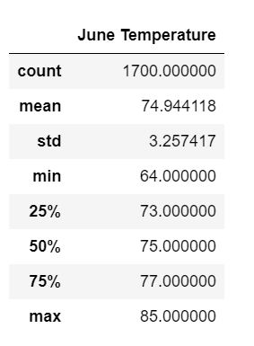
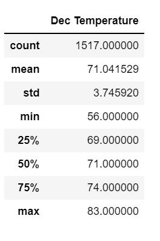
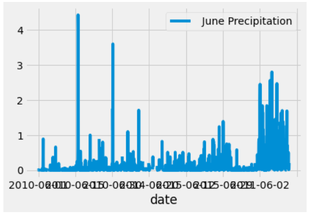
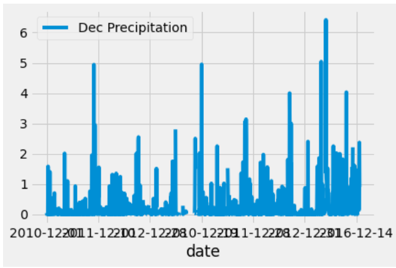

# Surfs_up
## Overview of the analysis:
This analysis will determine if the surf and ice cream shop business is sustainable year-round.
## Results: 
  

Based off the summary statistics of June and December above we can conclude:
- The temperature is relatively similar between the middle of summer and winter. An average difference between 4 degrees.
- The standard deviation is similar showing not much fluctuation throughout the year.
- With a small temperature change for the year, starting a surf and ice cream shop business would be successful.

## Summary: 
Two additional queries would be precipitation for June and December. The graphs below show each month's precipitation: 
  

Based off similar temperatures from the summary statistics (around 72 degrees) and low average of precipitation levels from the graphs above, opening a surf and ice cream shop would be a good business decision.
